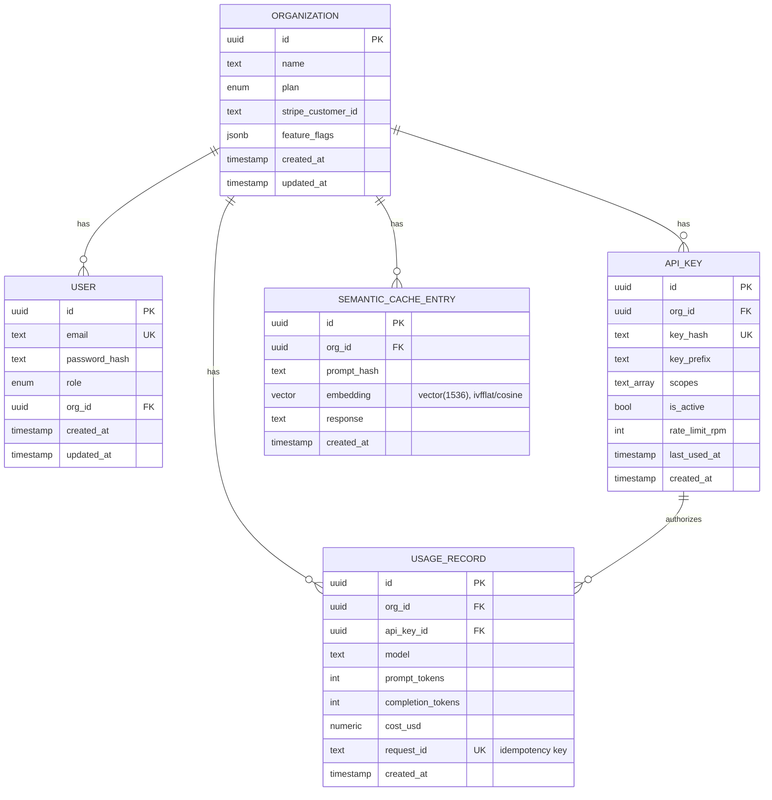

# CloudMesh — Phase 1 ER Diagram

## Notes

- **Idempotent billing**: `usage_records.request_id` is `UNIQUE` — a redelivered
  billing event hits a constraint violation instead of double-charging an org.
- **Row-Level Security**: `api_keys`, `usage_records`, and `semantic_cache` have
  `FORCE ROW LEVEL SECURITY` with a `tenant_isolation` policy on `org_id =
  current_setting('app.current_org')`. Verified against a live DB
  (`packages/db/prisma/migrations/20260715085500_rls_and_pgvector`,
  `20260715090000_app_role`): a session with no org set, or the wrong org set,
  sees 0 rows; the correct org sees its own rows. RLS only holds because the
  app connects as the non-superuser `cloudmesh_app` role — the Postgres
  bootstrap superuser (`POSTGRES_USER` from docker-compose) bypasses RLS
  unconditionally, so migrations run as that role but the application must not.
- **Feature flags**: `organizations.feature_flags` is JSONB — per-org toggles
  (`semantic_cache`, `streaming`, `rate_limit_rpm`, `allowed_models`,
  `request_dedup`) without a redeploy. Intended to be cached in Redis per org
  (TTL 60s) once the API layer exists — not implemented yet in Phase 1.
- **Semantic cache**: `embedding vector(1536)` + an `ivfflat` cosine-similarity
  index are added via raw SQL, not Prisma DSL — Prisma has no native pgvector
  column/index type, so this column is declared `Unsupported("vector(1536)")`
  in `schema.prisma` and the column/index live entirely in the migration SQL.
