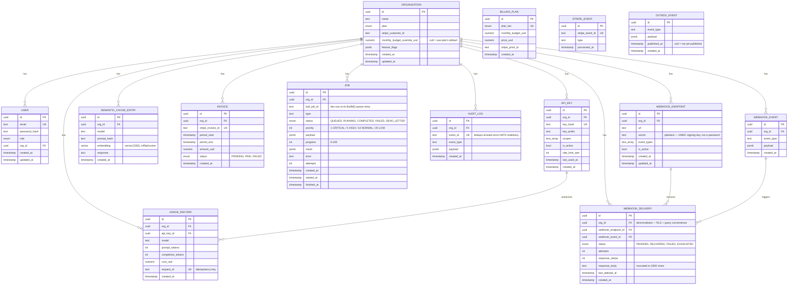

# CloudMesh — Phase 1 ER Diagram

```mermaid
erDiagram
    ORGANIZATION ||--o{ USER : has
    ORGANIZATION ||--o{ API_KEY : has
    ORGANIZATION ||--o{ USAGE_RECORD : has
    ORGANIZATION ||--o{ SEMANTIC_CACHE_ENTRY : has
    ORGANIZATION ||--o{ INVOICE : has
    ORGANIZATION ||--o{ JOB : has
    ORGANIZATION ||--o{ AUDIT_LOG : has
    ORGANIZATION ||--o{ WEBHOOK_ENDPOINT : has
    ORGANIZATION ||--o{ WEBHOOK_EVENT : has
    ORGANIZATION ||--o{ WEBHOOK_DELIVERY : has
    WEBHOOK_ENDPOINT ||--o{ WEBHOOK_DELIVERY : receives
    WEBHOOK_EVENT ||--o{ WEBHOOK_DELIVERY : triggers
    API_KEY ||--o{ USAGE_RECORD : authorizes

    ORGANIZATION {
        uuid id PK
        text name
        enum plan
        text stripe_customer_id
        numeric monthly_budget_override_usd "null = use plan's default"
        jsonb feature_flags
        timestamp created_at
        timestamp updated_at
    }

    USER {
        uuid id PK
        text email UK
        text password_hash
        enum role
        uuid org_id FK
        timestamp created_at
        timestamp updated_at
    }

    API_KEY {
        uuid id PK
        uuid org_id FK
        text key_hash UK
        text key_prefix
        text_array scopes
        bool is_active
        int rate_limit_rpm
        timestamp last_used_at
        timestamp created_at
    }

    USAGE_RECORD {
        uuid id PK
        uuid org_id FK
        uuid api_key_id FK
        text model
        int prompt_tokens
        int completion_tokens
        numeric cost_usd
        text request_id UK "idempotency key"
        timestamp created_at
    }

    SEMANTIC_CACHE_ENTRY {
        uuid id PK
        uuid org_id FK
        text model
        text prompt_hash
        vector embedding "vector(1536), ivfflat/cosine"
        text response
        timestamp created_at
    }

    BILLING_PLAN {
        uuid id PK
        enum plan_tier UK
        numeric monthly_budget_usd
        numeric price_usd
        text stripe_price_id
        timestamp created_at
    }

    INVOICE {
        uuid id PK
        uuid org_id FK
        text stripe_invoice_id UK
        timestamp period_start
        timestamp period_end
        numeric amount_usd
        enum status "PENDING, PAID, FAILED"
        timestamp created_at
    }

    STRIPE_EVENT {
        uuid id PK
        text stripe_event_id UK
        text type
        timestamp processed_at
    }

    OUTBOX_EVENT {
        uuid id PK
        text event_type
        jsonb payload
        timestamp published_at "null = not yet published"
        timestamp created_at
    }

    JOB {
        uuid id PK
        uuid org_id FK
        text bull_job_id "ties row to its BullMQ queue entry"
        text type
        enum status "QUEUED, RUNNING, COMPLETED, FAILED, DEAD_LETTER"
        int priority "1 CRITICAL / 5 HIGH / 10 NORMAL / 20 LOW"
        jsonb payload
        int progress "0-100"
        jsonb result
        text error
        int attempts
        timestamp created_at
        timestamp started_at
        timestamp finished_at
    }

    AUDIT_LOG {
        uuid id PK
        uuid org_id FK
        text event_id UK "dedups at-least-once NATS redelivery"
        text event_type
        jsonb payload
        timestamp created_at
    }

    WEBHOOK_ENDPOINT {
        uuid id PK
        uuid org_id FK
        text url
        text secret "plaintext — HMAC signing key, not a password"
        text_array event_types
        bool is_active
        timestamp created_at
        timestamp updated_at
    }

    WEBHOOK_EVENT {
        uuid id PK
        uuid org_id FK
        text event_type
        jsonb payload
        timestamp created_at
    }

    WEBHOOK_DELIVERY {
        uuid id PK
        uuid org_id FK "denormalized — RLS + query convenience"
        uuid webhook_endpoint_id FK
        uuid webhook_event_id FK
        enum status "PENDING, DELIVERED, FAILED, EXHAUSTED"
        int attempts
        int response_status
        text response_body "truncated to 2000 chars"
        timestamp last_attempt_at
        timestamp created_at
    }
```

## Notes

- **Idempotent billing**: `usage_records.request_id` is `UNIQUE` — a redelivered
  billing event hits a constraint violation instead of double-charging an org.
- **Row-Level Security**: `api_keys`, `usage_records`, and `semantic_cache` have
  `FORCE ROW LEVEL SECURITY` with a `tenant_isolation` policy on `org_id =
current_setting('app.current_org')`. Verified against a live DB
  (`packages/db/prisma/migrations/20260715085500_rls_and_pgvector`,
  `20260715090000_app_role`): a session with no org set, or the wrong org set,
  sees 0 rows; the correct org sees its own rows. RLS only holds because the
  app connects as the non-superuser `cloudmesh_app` role — the Postgres
  bootstrap superuser (`POSTGRES_USER` from docker-compose) bypasses RLS
  unconditionally, so migrations run as that role but the application must not.
- **Feature flags**: `organizations.feature_flags` is JSONB — per-org toggles
  (`semantic_cache`, `streaming`, `rate_limit_rpm`, `allowed_models`,
  `request_dedup`) without a redeploy. Intended to be cached in Redis per org
  (TTL 60s) once the API layer exists — not implemented yet in Phase 1.
- **Semantic cache**: `embedding vector(1536)` + an `ivfflat` cosine-similarity
  index are added via raw SQL, not Prisma DSL — Prisma has no native pgvector
  column/index type, so this column is declared `Unsupported("vector(1536)")`
  in `schema.prisma` and the column/index live entirely in the migration SQL.
  Cache entries are also scoped by `model` (Phase 6,
  `20260724095537_add_semantic_cache_model`) — a response cached for one
  model must never satisfy a lookup for another. **Gotcha for future
  migrations touching this table**: `prisma migrate dev`'s diff doesn't know
  about the ivfflat index (it's raw SQL, invisible to the DSL) and will
  silently `DROP INDEX` it as "untracked" on the next schema change that
  touches `semantic_cache` — the generated migration must have the
  `CREATE INDEX ... USING ivfflat` re-added by hand before it's applied, or
  the cosine search silently degrades to a full table scan. Caught here by
  manually diffing the migration's SQL against the previous one, not by a
  test (there isn't one — this is a migration-authoring gotcha, not
  something a query test would catch). **This gotcha is worse than
  originally documented**: Phase 7's migrations
  (`20260725024959_add_billing_phase7`, and even an empty `--create-only`
  migration touching nothing at all) both proposed dropping this index too
  — it's flagged as "drift" on essentially every `prisma migrate dev`
  invocation from now on, not just ones that touch `semantic_cache`. Always
  read the generated SQL before applying, every time, regardless of what
  the migration is nominally about.
- **Billing (Phase 7)**: `billing_plans` is a global catalog (plan tier ->
  budget/price), not tenant data — no RLS, same category as a price list.
  `invoices` has the same `tenant_isolation` RLS policy as `api_keys`/
  `usage_records`/`semantic_cache`
  (`packages/db/prisma/migrations/20260725025156_add_invoices_rls`).
  `stripe_events` (webhook redelivery dedup) and `outbox_events`
  (transactional outbox, see `apps/gateway/src/lib/outbox.ts`) deliberately
  have **no** RLS — both are only ever read by internal system processes
  (the webhook handler, the outbox poller), never by a tenant-scoped API
  request, so there's no tenant-isolation boundary for them to enforce.
  `organizations.monthly_budget_override_usd` is nullable — null means "use
  `billing_plans.monthly_budget_usd` for this org's plan tier," not
  "unlimited"; an org's plan tier having no seeded `billing_plans` row is
  what actually means unlimited (fail-open on missing config, not
  fail-closed on every request for an org whose tier was never seeded).
- **Async jobs (Phase 9)**: `jobs` has the same `tenant_isolation` RLS
  policy as the other tenant tables
  (`packages/db/prisma/migrations/20260727025749_add_jobs_phase9`). It
  deliberately duplicates state that BullMQ already keeps in Redis, because
  the two answer different questions: Redis holds transient execution state
  (retries, locks, the queue itself) and is evictable with no RLS, while
  this table is the durable, tenant-scoped system of record that
  `GET /v1/jobs/:id` reads and that DLQ review needs after Redis has
  dropped the finished job. Same split as Phase 7's outbox. The **worker**
  is the reason the RLS policy matters most here: it drains jobs for every
  org from one process, so it must set `app.current_org` per job (it
  connects as `cloudmesh_app`, never the migration superuser) — an unscoped
  read there returns zero rows rather than erroring, which is a silent
  failure mode worth knowing about.
- **Event bus (Phase 10)**: `audit_log` is written by the NATS audit
  subscriber and carries the same `tenant_isolation` RLS policy as every
  other tenant table
  (`packages/db/prisma/migrations/20260727131343_add_audit_log_phase10`).
  Its `event_id` UNIQUE constraint is load-bearing, not decorative: NATS
  JetStream delivers at least once, so the subscriber relies on hitting that
  constraint (catching Prisma's P2002) to skip a redelivered event. A
  check-then-insert would race itself when the same event reaches two
  consumers concurrently. Like the Phase 9 job worker, the subscribers
  consume events for every org from one process and must set
  `app.current_org` per message; events with no `org_id` are skipped rather
  than written unscoped. The table is append-only by convention — nothing in
  application code updates or deletes from it.
- **Webhooks (Phase 11)**: `webhook_endpoints`, `webhook_events`, and
  `webhook_deliveries` all carry the same `tenant_isolation` RLS policy as
  every other tenant table
  (`packages/db/prisma/migrations/20260727142228_add_webhooks_phase11`).
  `webhook_endpoints.secret` is stored **plaintext**, deliberately — unlike
  a password, it isn't compared, it's used as an HMAC-SHA256 signing key on
  every delivery, which requires the raw value at send time, not a one-way
  hash of it. RLS is the load-bearing control here: a leaked row would let
  an attacker forge signed payloads to that one endpoint, so cross-tenant
  read access to this table is exactly the failure RLS exists to prevent.
  `webhook_deliveries.org_id` is denormalized (also derivable via its
  `webhook_endpoint_id`/`webhook_event_id` FKs) for the same reason
  `usage_records.org_id` isn't derived through `api_keys` — RLS policies and
  hot-path queries both need `org_id` directly on the row being filtered,
  not through a join. `webhook_events` is written unconditionally on
  dispatch (Phase 11's "event sourcing for all platform events"
  deliverable), even for an org with zero subscribed endpoints — the event
  still happened and is durably recorded; it just produces zero
  `webhook_deliveries` rows. See `packages/webhooks` for the SSRF guard,
  HMAC signing, and BullMQ delivery queue/worker built on top of these
  tables, and CLAUDE.md's Phase 11 notes for why the SSRF check runs twice
  (registration **and** every delivery attempt — DNS can rebind in
  between).
